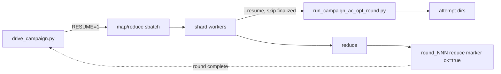

# Resumable Campaigns and the Top-Level Driver

This guide describes how the data factory runs very large AC-OPF campaigns
(hundreds of thousands to tens of millions of solves) safely across many
concurrent workers and across multiple Slurm jobs, and how to resume and
automate multi-round campaigns.

It covers four capabilities that work together:

1. Collision-safe attempt-directory allocation (concurrency).
2. Contingency-in-path output naming (traceability).
3. Resumable rounds (idempotent re-execution).
4. The top-level driver `scripts/drive_campaign.py` (automation).

## Mental model

A campaign is a sequence of **rounds**. Each round selects a budgeted set of
**candidates** (`case × operating point × topology × contingency × task`) and
solves them. On the cluster a round runs as a **map/reduce** Slurm job: the
selected candidates are sharded, workers solve shards in parallel (map), and a
deterministic reducer merges per-shard ledgers and writes a round completion
marker (reduce).



Independent layers make the campaign safe to interrupt and restart:

| Layer | Unit of idempotency | Skip signal |
|-------|--------------------|-------------|
| Run allocation | one attempt directory | atomic in-progress marker |
| Run execution | one candidate/config | a finalized `attempt_NNNNNN` exists |
| Shard scheduling | one shard | a `queue/done/<shard>` marker |
| Round orchestration | one round | reduce marker `ok: true` |

## 1. Collision-safe attempt allocation

Many workers write into a shared `runs-root` at once. Attempt directories are
claimed with `create_next_attempt_directory` in
[src/grid_data_factory/storage/layout.py](../src/grid_data_factory/storage/layout.py):

- `scan_max_attempt_index` finds the current highest index (counting both
  finalized `attempt_NNNNNN` and `.attempt_NNNNNN.in_progress` markers).
- Allocation loops from the next index, atomically `mkdir`-ing a
  `.attempt_NNNNNN.in_progress` marker. The atomic create breaks ties between
  racing processes; a loser simply advances to the next index.
- After claiming the marker it re-checks that the finalized directory does not
  exist. This closes the finalize-name race: another process may have finalized
  the same index in the window between the existence check and the claim. Only
  the marker holder can finalize, so once the marker is held and no finalized
  directory is present, the index is exclusively ours.

This was validated under a 48-process stress test (5 trials × 300 allocations)
with zero collisions. Thread-only tests do not exercise the real filesystem
race, so multi-process testing is required for changes here.

All AC-OPF runners use this allocator:
[run_ac_opf.py](../scripts/run_ac_opf.py),
[run_exago_ac_opf.py](../scripts/run_exago_ac_opf.py),
[run_pandapower_ac_opf.py](../scripts/run_pandapower_ac_opf.py), and
[run_campaign_ac_opf_round.py](../scripts/run_campaign_ac_opf_round.py).

## 2. Contingency-in-path output naming

For non-SCOPF tasks a contingency level is inserted into the run hierarchy so a
directory reveals its contingency at a glance:

```
data/runs/ac_opf/<case_id>/<topology_id>/<operating_point_id>/<contingency_slug>/<solver_id>/attempts/<attempt_id>/
```

The base (no-contingency) case uses `ctg_base`, so the layout is backward
compatible when no contingency is applied.

`contingency_slug` in
[src/grid_data_factory/contingencies/apply.py](../src/grid_data_factory/contingencies/apply.py)
produces a deterministic, filesystem-safe, human-readable token:

```
ctg_<kind><order>_<readable>_<hash8>
```

- `kind` is `k` for a simultaneous outage or `seq` for a sequential N-1-1 event.
- `order` is the number of outaged components.
- `readable` is the outaged components as `<type-initial><sanitized-id>` joined
  by `-` (sorted for simultaneous events, sequence-preserved for sequential
  events), truncated to 48 characters.
- `hash8` is the first 8 hex characters of a SHA-1 over the canonical outage set
  (not the enumeration index), so the token is stable across re-enumeration and
  unique even when the readable part is truncated or collides.

Examples:

| Contingency | Slug |
|-------------|------|
| none | `ctg_base` |
| branch 12 out | `ctg_k1_b12_0f650710` |
| branches 12 and gen 3 out | `ctg_k2_b12-g3_64b0f5be` |
| sequential: branch 5 then branch 9 | `ctg_seq2_b5-b9_eabd7c99` |

Because the slug is deterministic, the resume logic can reconstruct a
candidate's output directory without any external index (see below).

## 3. Resumable rounds

### Run-level skip (`--resume`)

[run_campaign_ac_opf_round.py](../scripts/run_campaign_ac_opf_round.py) accepts
`--resume`. When set, before solving each candidate it derives the candidate's
deterministic solver directory and skips the candidate if a finalized attempt
already exists there (`has_finalized_attempt`). The path is derived from the
candidate alone via two helpers so the skip check and the writer always agree:

- `_candidate_identity(candidate)` → `(case_id, topology_id, operating_point_id, contingency_id)`
  where `operating_point_id = op_<index>_<regime>` and `contingency_id` is the
  `contingency_slug`.
- `_candidate_solver_dir(runs_root, candidate, solver_id)` → the full solver
  directory including the contingency level.

Skipped candidates are recorded and excluded from the failure accounting: the
round report adds `skipped_count` and computes `failure_fraction` over
*solvable* (non-skipped) candidates, so resuming never inflates the failure
rate with already-done work.

### Shard-level skip (Slurm `RESUME`)

[configs/slurm/andes_powermodels_acopf_mapreduce_10n_36h.sbatch](../configs/slurm/andes_powermodels_acopf_mapreduce_10n_36h.sbatch)
accepts `RESUME=1`. When resuming an existing round:

- Bootstrap and re-sharding are skipped; the existing shard files are reused.
- A worker skips any shard that already has a `queue/done/<shard>` marker.
- The map script is invoked with `--resume` so partially-completed shards skip
  their finished configurations.
- Each shard is marked done (`touch queue/done/<shard>`) only after its map call
  returns successfully.

The reduce stage remains deterministic, so re-reducing a resumed round yields
the same merged ledgers and the same round marker.

### Round-level completion signal

A round is complete when its reduce marker exists with `"ok": true`:

```
data/campaigns/<campaign_id>/round_summaries/round_<NNN>_mapreduce_reduce_report.json
```

`ok` is set by the reducer only when no shard reports are missing.

## 4. Top-level driver

[scripts/drive_campaign.py](../scripts/drive_campaign.py) automates multi-round
completion. It finds the **furthest incomplete round** — the lowest round index
whose reduce marker is missing or not `ok` — and resubmits it with `RESUME=1`.
Because rounds run in sequence, that is the round currently in progress, so a
single invocation transparently resumes an interrupted campaign.

### Options

| Flag | Purpose |
|------|---------|
| `--campaign-id` | Campaign to drive (required). |
| `--rounds` | Total number of rounds (required). |
| `--sbatch` | Per-round map/reduce sbatch (defaults to the 10-node 36h template). |
| `--config` | Campaign config (default `configs/campaign_default.yaml`). |
| `--total-budget` | If > 0, split across rounds via the budget schedule. |
| `--budget` | Per-round budget when `--total-budget` is not used. |
| `--budget-schedule` | `constant`, `linear`, or `geometric`. |
| `--budget-ratio` | Ratio for `linear`/`geometric` schedules. |
| `--chain` | Also queue all subsequent rounds, chained via `afterok`. |
| `--nodes` | Override sbatch node count (0 keeps the template header value). |
| `--ntasks-per-node` | Override sbatch tasks per node (0 keeps the header value). |
| `--cpus-per-task` | Override sbatch cpus per task (0 keeps the header value). |
| `--time` | Override sbatch walltime, e.g. `36:00:00` (empty keeps the header value). |
| `--dry-run` | Print the submission plan without calling `sbatch`. |
| `--set KEY=VALUE` | Extra environment override passed through to the job (repeatable). |

Reserved keys (`CAMPAIGN_ID`, `ROUND_INDEX`, `RESUME`, `BUDGET`) always take
precedence over `--set` values. Environment is passed to `sbatch` via the child
process environment (not `--export`) to avoid comma-parsing issues.

### Resume the current round only

```bash
cd /lustre/orion/lrn070/proj-shared/mlupopa/OPF/power_grid_data_factory
PYTHONPATH=src python3.11 scripts/drive_campaign.py \
  --campaign-id ultrascale_150m \
  --rounds 10 \
  --total-budget 150000000 \
  --set MAX_K=10 \
  --nodes 64 --ntasks-per-node 16 --cpus-per-task 1 --time 36:00:00
```

### Chain all remaining rounds (unattended completion)

```bash
cd /lustre/orion/lrn070/proj-shared/mlupopa/OPF/power_grid_data_factory
PYTHONPATH=src python3.11 scripts/drive_campaign.py \
  --campaign-id ultrascale_150m \
  --rounds 10 \
  --total-budget 150000000 \
  --set MAX_K=10 \
  --nodes 64 --ntasks-per-node 16 --cpus-per-task 1 --time 36:00:00 \
  --chain
```

With `--chain`, each subsequent round is submitted with an
`--dependency=afterok:<prev>` so it starts only after the previous round's job
succeeds. For a 150M-solve campaign of 10 rounds this queues rounds `r..9` each
with a 15M budget.

### Preview without submitting

Add `--dry-run` to print the plan (detected completed rounds, furthest
incomplete round, and per-round overrides) without calling `sbatch`. Example
output:

```
campaign=ultrascale_150m rounds=10 completed=[0, 1] furthest_incomplete=2
[dry-run] sbatch ... overrides={'CAMPAIGN_ID': 'ultrascale_150m', 'ROUND_INDEX': '2', 'RESUME': '1', 'BUDGET': '15000000'}
```

## Monitoring progress

[scripts/monitor_campaign.py](../scripts/monitor_campaign.py) prints a read-only
progress dashboard for a round without walking the (potentially millions of)
attempt directories — it reads the bootstrap intermediate files, the per-shard
execution reports, and the `queue/done` markers.

```bash
cd /lustre/orion/lrn070/proj-shared/mlupopa/OPF/power_grid_data_factory
PYTHONPATH=src python3.11 scripts/monitor_campaign.py \
  --campaign-id ultrascale_150m_v1 --round-index 0 --watch 30
```

It reports the coarse pipeline stage (bootstrap sub-stage → sharding → map →
reduce), candidate counts, shards done/total, aggregated solved/failed/skipped
counts, and whether the reduce marker is `ok`.

Note: the bootstrap stage runs on the batch head node. The contingency
enumeration sub-stage is parallelized across cores (`BOOTSTRAP_WORKERS`, default
16); operating-point generation, screening, and selection remain single-process.

## HPC scale and I/O performance

At 150M-solve scale a single round processes ~15M candidates across ~8192
shards on 1024 ranks. Two classes of problem dominate at that size: **hidden
super-linear work** (an `O(n²)` step that is invisible at 10³ but fatal at 10⁷)
and **Lustre metadata pressure** (millions of tiny file operations). The
following features keep both bounded. Each was validated in isolation before use.

### O(1) unit-cube sampling

Operating points are drawn by sampling the unit hypercube in
[src/grid_data_factory/scenarios/operating_point_generation.py](../src/grid_data_factory/scenarios/operating_point_generation.py).
The original `latin_hypercube` path rebuilt and shuffled a length-`total`
permutation **on every sample**, i.e. `O(total²)` per case — at
`PER_CASE=210000` this alone stalled the round before any solve began.

`sample_unit_vector` now generates each stratum with an **affine-cipher
permutation**: `stratum = (a_d · idx + b_d) mod total`, with `a_d` chosen
coprime to `total` (via `_coprime_multiplier` + the SplitMix64 finalizer
`_mix64`). This is a bijection over `[0, total)` — true Latin-hypercube
stratification (one sample per stratum) — computed in **`O(1)` per sample** with
no per-call allocation, and it is deterministic and independent of
`PYTHONHASHSEED`. The value is `(stratum + rng.random()) / total`. The original
implementation is preserved as `sample_unit_vector_legacy` (carrying a warning
docstring) for reference and tests. Measured ~43× faster at `N=4000` with the
gap growing linearly; ~6.7 s/case at `PER_CASE=210000`.

### O(1) selection bookkeeping

`run_campaign_round` in
[src/grid_data_factory/campaigns/campaign_round.py](../src/grid_data_factory/campaigns/campaign_round.py)
records a decision per candidate. It previously matched each selected candidate
back to its record with a linear scan (`next(x for x in selected …)`), an
`O(n²)` pattern over the selected set. It now builds a `candidate_id → record`
dictionary once and looks up in `O(1)`, so decision recording is linear in the
candidate count.

### Full-budget selection fast path

`select_ac_evaluations` in
[src/grid_data_factory/acquisition/selector.py](../src/grid_data_factory/acquisition/selector.py)
normally builds six ranked queues (`build_queues`) to allocate a scarce budget.
That machinery does six full sorts of the candidate set **and a `dict()` copy of
every candidate in two of the queues** — at 15M candidates that measured ~20 min
and ~190 GB RSS on one core, dangerously close to the node limit.

When `AUDIT_FRACTION=1.0` (solve everything) the per-round budget is set to
**cover all candidates**, so the ranking is irrelevant — every candidate is
selected regardless of order. The selector now short-circuits: when
`budget >= len(candidates)` it takes a single `O(n)` pass (constraint-filtered,
labelled `full_budget`) and skips `build_queues` entirely. Budgets smaller than
the candidate count keep the full multi-queue strategy unchanged. To hit the
fast path, keep the per-round budget at or above the enumerated candidate count
(`PER_CASE × cases × contingencies_per_op`).

### Streaming shard split

[scripts/shard_selected_candidates.py](../scripts/shard_selected_candidates.py)
divides the selected-candidate JSONL into thousands of shards for the map stage.
Its default path loaded the **entire** selected file into memory as dicts, and
with `--backfill-from-pool` it also loaded the pool file — at 15M candidates that
was ~180 GB **each** (~360 GB, an OOM on a 230 GB node), and it re-read the whole
input a second time just to count lines for the manifest.

The `--stream` flag (set in the Andes sbatch) splits line-by-line to one open
append handle per shard (raising `RLIMIT_NOFILE` for the ~8192 handles),
accumulates coverage counts in the same pass, scans the pool only for its bucket
*set* (not its rows), and does any coverage backfill as a targeted streaming
pass. Peak memory stays roughly flat regardless of candidate count, and the
output is identical to the in-memory path. The in-memory path is retained for
small runs and unit tests.

### Slim ledgers by default

Two ledgers — `candidate_registry` and `acquisition_decisions` — previously
duplicated the **full** ~15M-candidate set every round (~75 GB) and built a
15M-row decision list alongside the candidate and selected lists, giving a ~3×
memory peak that risked OOM on a 230 GB node. Neither ledger is read by
[reduce_campaign_shards.py](../scripts/reduce_campaign_shards.py).

By default the round now writes a single **aggregate** decision row
(round index, candidate/selected counts, per-queue selection counts, seed) and
**skips** `candidate_registry` entirely. Set `CAMPAIGN_FULL_LEDGERS=1` to restore
the full per-candidate ledgers when doing a detailed audit.

### Keep-open shard writer (Lustre metadata relief)

Each shard streams its solved records to one `ac_opf/samples.jsonl` file (plus a
`shard_manifest.json`); the per-case output is already aggregated, so the shard
count stays at ~8192/round rather than millions. The remaining metadata
stressor was the **writer itself**: the legacy `_append_sample` reopened the
file (`open(append) → write → close`) once per solved case, i.e. ~15M Lustre
metadata round-trips per round.

`SampleSink` in
[src/grid_data_factory/campaigns/round_runner.py](../src/grid_data_factory/campaigns/round_runner.py)
holds **one open handle per shard** for the shard's lifetime, collapsing ~15M
opens/round to ~8192. It flushes every 200 records so an abrupt kill loses at
most that many un-flushed lines, and `_loaded_sample_ids` tolerates a truncated
trailing line, so resume stays correct. Output is byte-for-byte identical to the
legacy writer. `_append_sample` is retained for the ExaGO path and tests; only
the PowerModels AC map path uses the sink.

### Walltime-signal flushing

`SampleSink` additionally drains its buffer to **~0 lost lines** when a job runs
out of wall clock, via two signal handlers:

- **SIGTERM** — always sent by Slurm before the final `SIGKILL` (grace period
  `KillWait`). The handler flushes and `fsync`s, then chains to the previous or
  default handler so the task still terminates normally. This is automatic and
  requires no configuration.
- **SIGUSR1** — an *earlier* warning. The map `srun` requests
  `--signal=USR1@120`, so `slurmstepd` signals each task's process group 120 s
  before the wall clock; the handler flushes and `fsync`s but **keeps solving**.
  The shard-picker `bash` uses `trap 'true' USR1` so the loop survives the
  warning (children reset `USR1` to a catchable default, then install the Python
  handler).

Handlers are restored on `close()`, and installation is silently skipped when
the sink is created off the main thread.

### Clean-environment job submission

The compute-node interpreter is `/usr/bin/python3.11`, and `PyYAML` lives in the
default user site (`~/.local/lib/python3.11/site-packages`). Do **not**
`module load python/3.7-anaconda3` before `sbatch`/`drive_campaign.py`: it sets
`PYTHONUSERBASE`, which leaks to the compute nodes through `sbatch --export=ALL`
and makes `python3.11` miss `yaml`, so every task dies immediately on
`import yaml`. Submit from a clean shell:

```bash
unset PYTHONUSERBASE PYTHONNOUSERSITE
PYTHONPATH=src python3.11 scripts/drive_campaign.py …
```

## Typical end-to-end flow

1. Launch the campaign (bootstrap the first round on the cluster, or plan rounds
   with [launch_ultrascale_campaign.py](../scripts/launch_ultrascale_campaign.py)).
2. If a job is preempted or hits its wall clock, run `drive_campaign.py` to
   resume the furthest incomplete round with `RESUME=1`.
3. For unattended completion, submit once with `--chain` so every remaining
   round is queued with `afterok` dependencies.
4. Verify progress by inspecting the reduce markers under
   `data/campaigns/<campaign_id>/round_summaries/`.

## Validation

Run the full test suite (Python 3.11; `pytest` is not installed):

```bash
cd /lustre/orion/lrn070/proj-shared/mlupopa/OPF/power_grid_data_factory
PYTHONPATH=src python3.11 -m unittest discover -s tests
```

Relevant tests:

- [tests/test_attempt_allocation.py](../tests/test_attempt_allocation.py) —
  sequential, concurrent, skip-existing, and `has_finalized_attempt` cases.
- [tests/test_contingency_slug.py](../tests/test_contingency_slug.py) — slug
  determinism, ordering, and hash uniqueness.
- [tests/test_campaign_resume.py](../tests/test_campaign_resume.py) — candidate
  identity/solver-dir determinism and resume-skip detection.
- [tests/test_drive_campaign.py](../tests/test_drive_campaign.py) — round
  completion detection, furthest-incomplete logic, budget splitting, and env
  construction.
